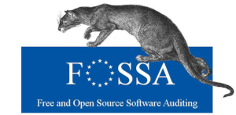
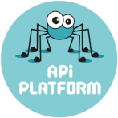
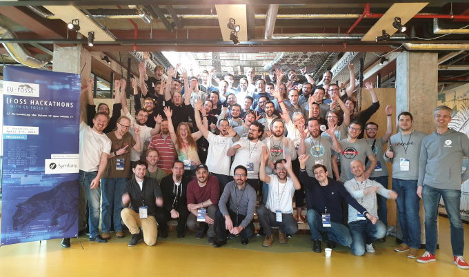

<h1 align="center">Symfony Hackathon 2019</h1>

The [EU-FOSSA](https://joinup.ec.europa.eu/collection/eu-fossa-2/about) project developed by [European institutions](https://europa.eu/) is aiming at improving the security of Open Source Software.

As part of EU-FOSSA 2, the [European Commission](https://ec.europa.eu/) is organising several [hackathons](https://eufossahackathon.bemyapp.com/) where developers from both the projects and the European Institutions that rely on their software, can come together.

With over 50 participants, the first hackathon focused on PHP [Symfony](https://symfony.com) and [API Platform](https://api-platform.com/).
It took place in Brussels on 6 and 7 April 2019.

During the hackathon, some of the most active developers from the PHP Symfony community got together, many for the first time. Their time together was spent working on important issues for the community and the EU institutions such as new features and security.

## Achievements

The participants worked on different activities, not only coding but also reflecting on different topics such as diversity within the community.

See [repositories statistics](achievements/statistics.md) and the different topics that have been worked on:

* [API Platform](achievements/api-platform.md)
* [Console](achievements/console.md)
* [Diversity](achievements/diversity.md)
* [Doctrine](achievements/doctrine.md)
* [Documentation](achievements/documentation.md)
* [Flysystem](achievements/flysystem.md)
* [Messenger](achievements/messenger.md)
* [Secrets](achievements/secrets.md)
* [Security](achievements/security.md)
* [Serializer](achievements/serializer.md)

## Testimonials

> So proud we took part in the 1st #Symfony #FOSSHackathons in Brussels alongside more than 50 contributors! Thanks for this awesome #EUFOSSA initiative @EU_DIGIT! Feels great to see all these amazing people working together on the future of the #opensource community
> - SensioLabs, "Créateur de Symfony"

> It's been great to have 59 contributors from the Symfony, API Platform and Doctrine communities in one place to work on open source projects together. Massive thanks to the @EU_Commission for funding such an event!
> - Michael Cullum, Symfony Security Lead

> Two years ago I promised @nicolasgrekas to document how to configure the #symfony cache component. This weekend I finally managed to gather all the resources and create the PR. Thank you @EU_Commission and everybody that helped me.
> - Tobias Nyholm, Symfony Core team and CARE team

> Thanks to #EUFOSSA #FOSSHackathons, @doctrineproject finally managed to throw in some focused work on automating the release flow, hopefully speeding up PR triaging by a huge lot!
> - Marco Pivetta, Doctrine Project Core team

> Back at home after 2 awesome days with the @symfony and @ApiPlatform ecosystem, I'm glad to be part of this community and this is really pushing me into more contribution thanks to all the people involved ! @bemyappBE @EU_DIGIT @coopTilleuls
> - Hamza Amrouche, API Platform Core team

## Resources, tweets and links

* [Resources](resources.md)
* [Tweets](tweets.md)

## Event contributors

[List of contributors](contributors.md).
