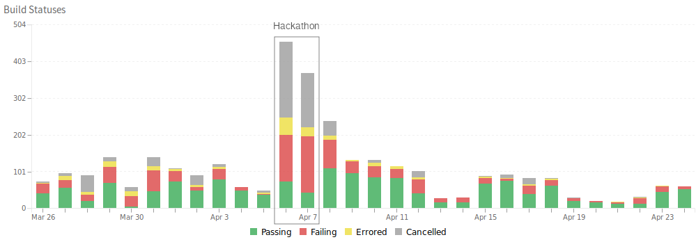

# Repositories statistics

## Code (overall)

|                          | Total |
| ------------------------ | ----- |
| Merged Pull Requests     | 107   |
| Proposed Pull Requests   | 181   |
| Closed Issues            |  79   |
| New Issues               | 143   |

## API Platform (all repositories)

|                          | Total |
| ------------------------ | ----- |
| Merged Pull Requests     | 20    |
| Proposed Pull Requests   | 10    |
| Closed Issues            | 87    |
| New Issues               | 4     |

## Security

* 2 security issues were fixed
* 3 other security issues were worked on

## Documentation

|                          | Total |
| ------------------------ | ----- |
| Merged Pull Requests     |  35   |
| Proposed Pull Requests   |  17   |
| Closed Issues            |  11   |
| New Issues               |   3   |

## Diversity

|                          | Total |
| ------------------------ | ----- |
| Existing issues closed   | 17    |
| New issues created       | 12    |
| Diversity PRs merged     | 3     |
| Documentation PRs merged | 3     |

For more information, see [the diversity achievements](diversity.md).

## Continuous Integration builds

The below graph shows the activity of the continuous integration pipeline during and after the event.

## 'EUFOSSA Hackathon' labelled issues and pull requests

### Main Symfony repository

* [Issues](https://github.com/symfony/symfony/issues?utf8=%E2%9C%93&q=label%3A%22%E2%AD%90%EF%B8%8F+EUFOSSA+Hackathon%22)
* [Pull requests](https://github.com/symfony/symfony/pulls?utf8=%E2%9C%93&q=label%3A%22%E2%AD%90%EF%B8%8F+EUFOSSA+Hackathon%22)

### Main API Platform repository

* [Issues](https://github.com/api-platform/api-platform/issues?utf8=%E2%9C%93&q=label%3A%22EU-FOSSA+Hackathon%22+)
* [Pull requests](https://github.com/api-platform/api-platform/pulls?utf8=%E2%9C%93&q=label%3A%22EU-FOSSA+Hackathon%22+)

### Symfony documentation repository

* [Issues](https://github.com/symfony/symfony-docs/issues?utf8=%E2%9C%93&q=label%3A%22%E2%AD%90%EF%B8%8F+EU-FOSSA+Hackathon%22+)
* [Pull requests](https://github.com/symfony/symfony-docs/pulls?utf8=%E2%9C%93&q=label%3A%22%E2%AD%90%EF%B8%8F+EU-FOSSA+Hackathon%22+)
